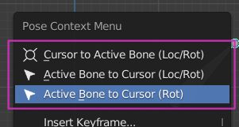

# Cursor Snap Extras (Blender Addon)

Snap active bone location and rotation from/to cursor. Support Quaternion and Euler.

## V.01:
- Move and rotate 3D Cursor to Active Pose Bone
- Move and rotate Active Pose Bone to 3D Cursor
- Support Euler and Quaternion rotations (I always assume that the cursor uses euler mode).

## V.02:
- Add Only rotate active bone to cursor.

 

## To-Do
- Change local transforms to global
- Add support for Object and Edit Mode
